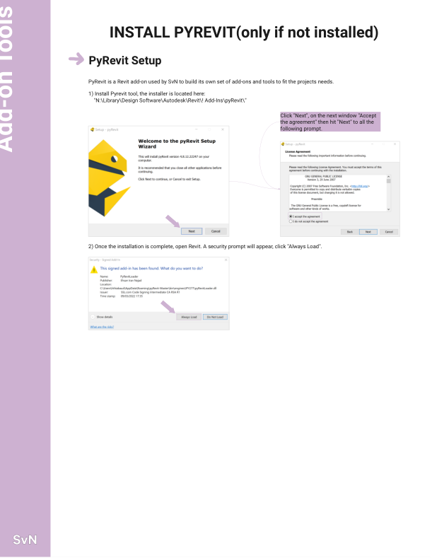
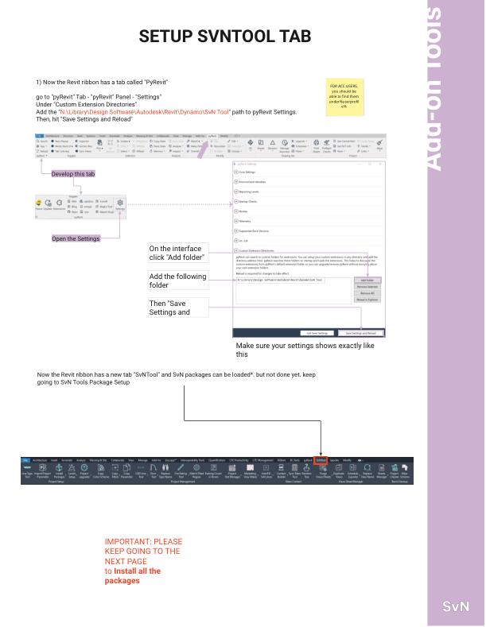
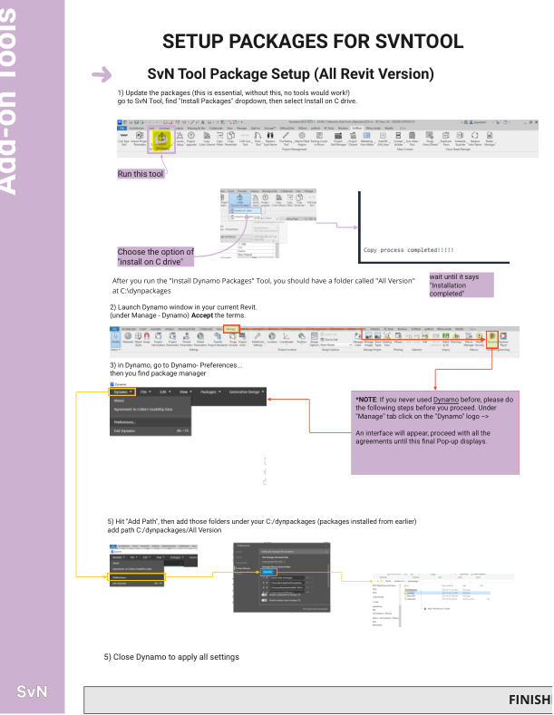
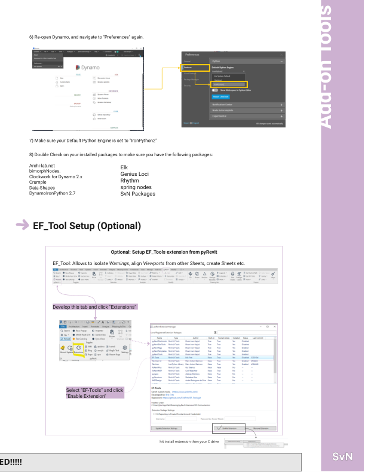
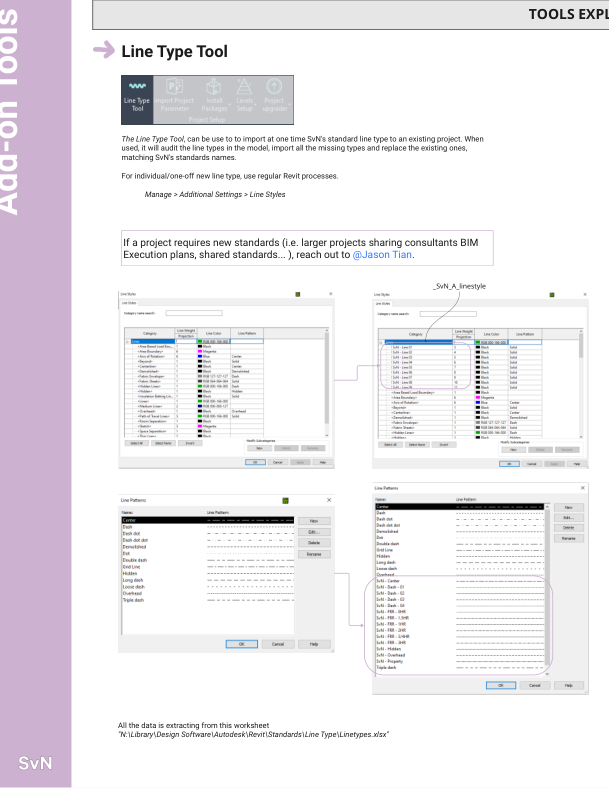
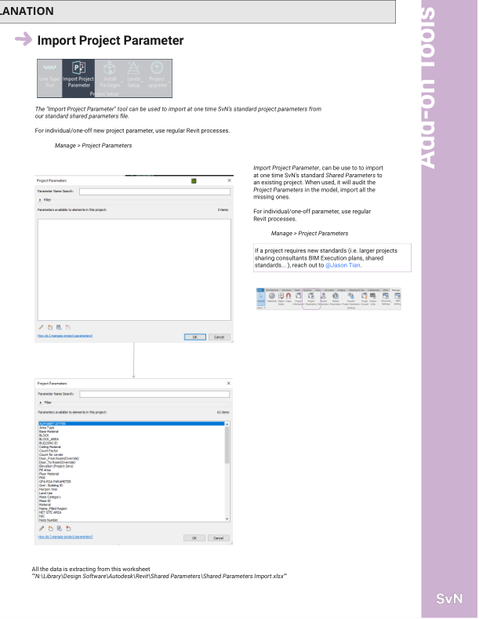
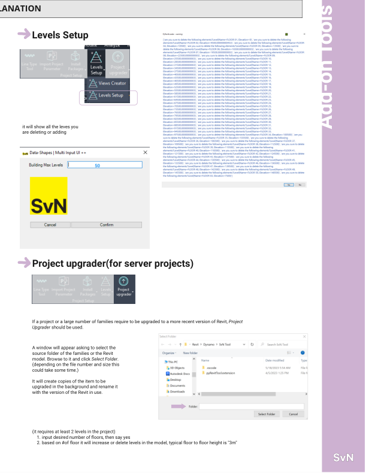
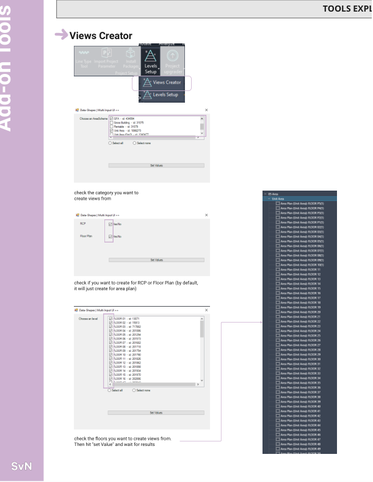

# 1. Project Setup

This page documents setup steps and tools found under the WWPTools add-on tab.

## Prerequisites and setup

### Install pyRevit (required)
Location: Revit installer
Screenshot: 
Purpose: Required host for WWPTools and SvNTool extensions.
How to use:
1. Run the installer from `N:\Library\Design Software\Autodesk\Revit\! Add-Ins\pyRevit\pyRevit_4.8.12.22247_signed.exe`.
2. Accept the agreement and continue through all prompts.
3. Open Revit and click "Always Load" on the security prompt.

### Install WWPTools MSI
Location: GitHub Releases
Screenshot: (Add later)
Purpose: Install the WWPTools add-in via the official MSI.
How to use:
1. Download the latest MSI from `https://github.com/SvN-Architects-Planners/WWPTools/releases/latest`.
   - Current release: `WWPTools-v1.1.3.msi`
2. Run the MSI and follow the prompts.
3. Open Revit and verify the WWPTools tab is visible.

### Register SvNTool extensions in pyRevit (legacy)
Location: Revit > pyRevit tab > pyRevit panel > Settings
Screenshot: 
Purpose: Add the SvNTool extension folder so the tab appears in Revit.
How to use:
1. In pyRevit Settings, under Custom Extension Directories, click "Add folder".
2. Add `N:\Library\Design Software\Autodesk\Revit\Dynamo\SvN Tool`.
3. Click "Save Settings and Reload".

### Dynamo first-time setup (legacy)
Location: Revit > Manage tab > Dynamo
Screenshot: 
Purpose: Accept the Dynamo license and install core components.
How to use:
1. Launch Dynamo from Revit and accept the terms.
2. When prompted, choose "Install on C drive".

### Install SvNTool Dynamo packages (legacy)
Location: SvNTool tab > Install Packages
Screenshot: 
Purpose: Install required Dynamo packages for all tools.
How to use:
1. In SvNTool, use Install Packages and select "Install on C drive".
2. In Dynamo, go to Preferences and open the Package Manager settings.
3. Add package path `C:\dynpackages\All Version`.
4. Close Dynamo to apply settings.

### Optional: enable EF_Tools extension (legacy)
Location: Revit > pyRevit tab > Extensions
Screenshot: 
Purpose: Enable EF_Tools add-on features.
How to use:
1. Select "EF-Tools" and click "Enable Extension".
2. If prompted, install to the C drive.
3. In Dynamo Preferences, set Default Python Engine to IronPython2.
4. Verify packages are installed:
   - Archi-lab.net
   - bimorphNodes
   - Clockwork for Dynamo 2.x
   - Crumple
   - Data-Shapes
   - DynamoIronPython 2.7
   - Elk
   - Genius Loci
   - Rhythm
   - spring nodes
   - SvN Packages

## Tool reference

### Line Type Tool
Location: WWPTools > 1. Project Setup > Line Type Tool
Screenshot: 
Purpose: Import and standardize line types in the project.
Source file: `N:\Library\Design Software\Autodesk\Revit\Standards\Line Type\Linetypes.xlsx`
How to use:
1. Run the tool and follow prompts.
2. Review the results and undo if needed.

### Add Project Parameter (Pulldown)
Purpose: Import standard shared parameters or build a template.

#### Create Template
Location: WWPTools > 1. Project Setup > Add Project Parameter > Create Template
Screenshot: 
Purpose: Create an Excel template with shared parameters listed in the Variables sheet.
How to use:
1. Have the target sheet(s) available or selected as prompted.
2. Run the tool and follow prompts.
3. Review the results and undo if needed.

#### Import from Excel
Location: WWPTools > 1. Project Setup > Add Project Parameter > Import from Excel
Screenshot: 
Purpose: Import shared parameters from a workbook.
Source file: `N:\Library\Design Software\Autodesk\Revit\Shared Parameters\Shared Parameters Import.xlsx`
How to use:
1. Prepare the Excel file you want to import.
2. Run the tool and follow prompts.
3. Review the results and undo if needed.

### Levels Setup (Pulldown)
Purpose: Manage levels and generate views.

#### Levels Setup
Location: WWPTools > 1. Project Setup > Levels Setup > Levels Setup
Screenshot: 
Purpose: Add or remove levels based on a target floor count.
How to use:
1. Enter the desired number of floors.
2. Confirm the list of levels being added or deleted.

#### Views Creator
Location: WWPTools > 1. Project Setup > Levels Setup > Views Creator
Screenshot: 
Purpose: Create Area Plans, Floor Plans, and RCPs for selected levels.
How to use:
1. Choose categories and view types (Area Plan, Floor Plan, or RCP).
2. Select the floors to create.
3. Click "Set Value" and wait for results.

### Project Upgrader
Location: WWPTools > 1. Project Setup > Project Upgrader
Screenshot: 
Purpose: Batch-upgrade families or models to the current Revit version.
How to use:
1. Select the source folder and click Select Folder.
2. Wait for the tool to process and rename upgraded files.
