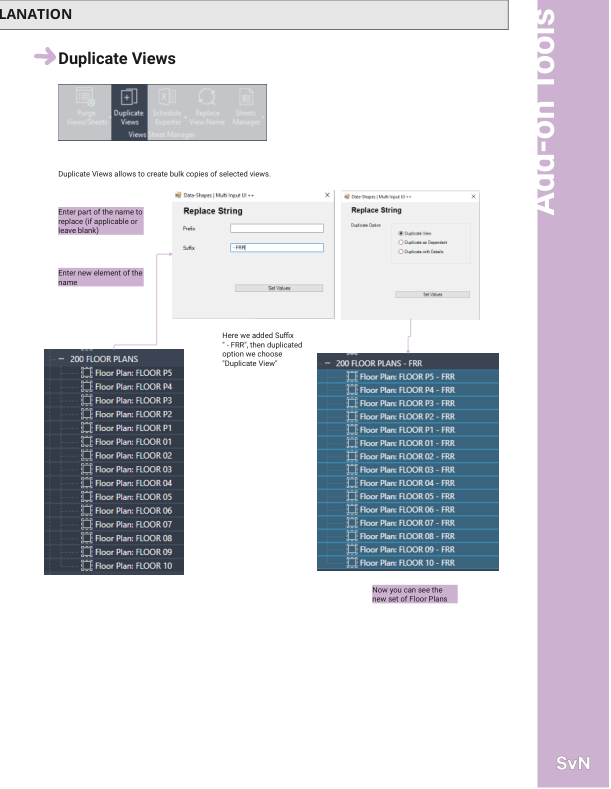
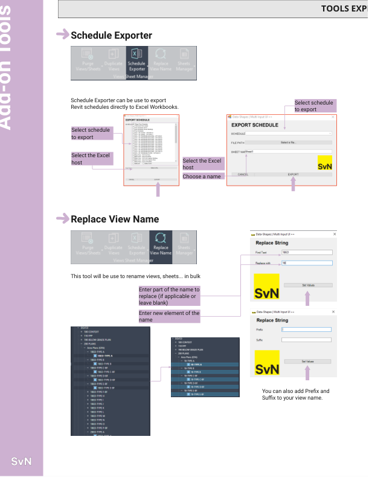
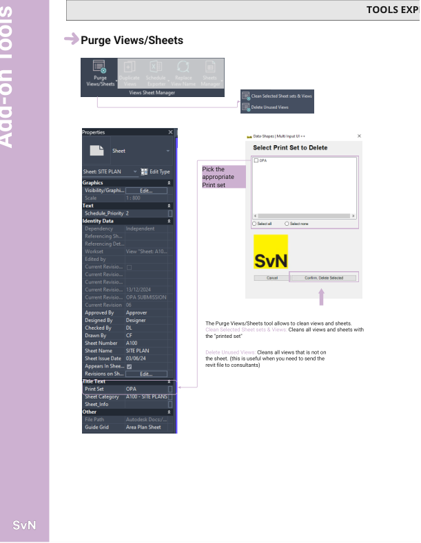
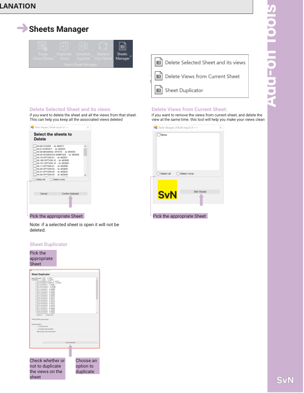

# 4. Views Sheet Manager

This page documents the tools found under this WWPTools panel.

## Duplicate Views
Location: WWPTools > 4. Views Sheet Manager > Duplicate Views
Screenshot: 
Purpose: Duplicate selected views and update names in bulk.
How to use:
1. Select the target views.
2. Enter the text to replace (or leave blank).
3. Enter the new text or suffix.
4. Choose the duplicate option and run.

## Replace View Name
Location: WWPTools > 4. Views Sheet Manager > Replace View Name
Screenshot: 
Purpose: Find and replace text in view names or type names.
How to use:
1. Enter the search text and replacement text.
2. (Optional) Add prefix or suffix.
3. Run the tool and review results.

## Schedules to Excel/CSV
Location: WWPTools > 4. Views Sheet Manager > Schedules to Excel/CSV
Screenshot: 
Purpose: Export schedules to Excel worksheets or CSV files.
How to use:
1. Select schedules to export.
2. Choose the Excel host file or a folder for CSV output.
3. Run the tool and review results.

## Sheets Renumber
Location: WWPTools > 4. Views Sheet Manager > Sheets Renumber
Screenshot: (Add later)
Purpose: Renumber a selected set of sheets.
How to use:
1. Select the target sheets.
2. Run the tool and follow prompts.

## Purge Views/Sheets (Pulldown)
Purpose: Clean up views not on sheets and selected sheets.

### Clean Selected Sheet sets & Views
Location: WWPTools > 4. Views Sheet Manager > Purge Views/Sheets > Clean Selected Sheet sets & Views
Screenshot: 
Purpose: Clean views and sheets using the selected print set.
How to use:
1. Select the target sheet set and views.
2. Run the tool and follow prompts.

### Delete Unused Views
Location: WWPTools > 4. Views Sheet Manager > Purge Views/Sheets > Delete Unused Views
Screenshot: 
Purpose: Delete views that are not placed on sheets.
How to use:
1. Run the tool and follow prompts.

## Sheets Manager (Pulldown)
Purpose: Duplicate or delete sheets and views.

### Delete Current Selected Sheet and its views
Location: WWPTools > 4. Views Sheet Manager > Sheets Manager > Delete Current Selected Sheet and its views
Screenshot: 
Purpose: Delete selected sheets and all views on them.
How to use:
1. Select the target sheets.
2. Run the tool and follow prompts.
Note: Open sheets will not be deleted.

### Delete Sheets and its views from list
Location: WWPTools > 4. Views Sheet Manager > Sheets Manager > Delete Sheets and its views from list
Screenshot: 
Purpose: Delete selected sheets and all views on them.
How to use:
1. Select the target sheets.
2. Run the tool and follow prompts.
Note: Open sheets will not be deleted.

### Delete Views from Current Sheet
Location: WWPTools > 4. Views Sheet Manager > Sheets Manager > Delete Views from Current Sheet
Screenshot: 
Purpose: Delete views from the current sheet and the project browser.
How to use:
1. Activate the sheet you want to modify.
2. Run the tool and follow prompts.

### Sheet Duplicator
Location: WWPTools > 4. Views Sheet Manager > Sheets Manager > Sheet Duplicator
Screenshot: 
Purpose: Duplicate selected sheets from a list.
How to use:
1. Select the target sheets.
2. Choose whether to duplicate views on the sheet.
3. Run the tool and follow prompts.
