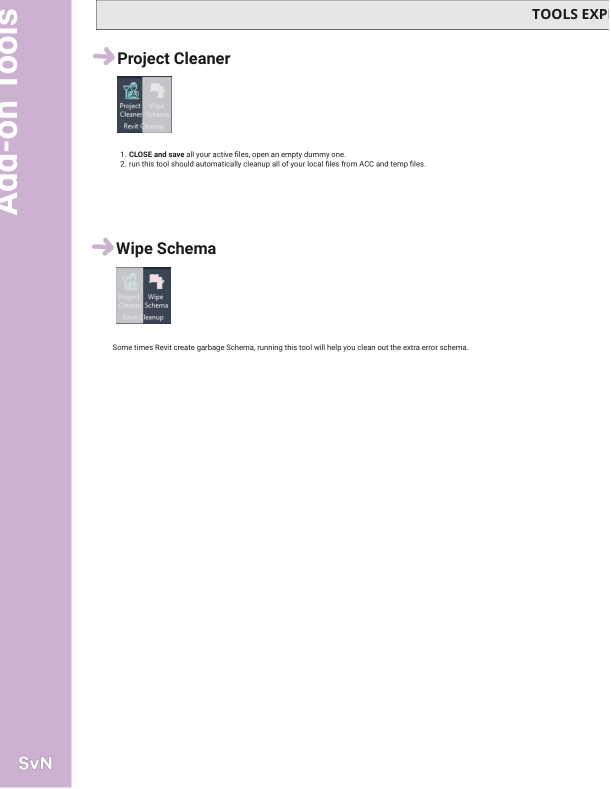

# 5. Revit Cleanup

This page documents the tools found under this WWPTools panel.

## Project Cleaner
Location: WWPTools > 5. Revit Cleanup > Project Cleaner
Screenshot: 
Purpose: Delete temp files, local files, and ACC caches.
How to use:
1. Close and save all active files.
2. Open an empty dummy file.
3. Run Project Cleaner and follow prompts.

## Wipe Schema
Location: WWPTools > 5. Revit Cleanup > Wipe Schema
Screenshot: 
Purpose: Remove stale or extra Revit schema data.
How to use:
1. Run the tool and follow prompts.
